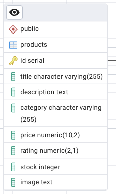

# ProdView - Product Management App

**ProdView** is a monorepo containing a full-stack application for product management. The backend is built using **Node.js, Express, and PostgreSQL** with `pg-promise`, while the frontend uses **React, Vite, and Material-UI**. The app provides API endpoints for managing products and displays them with pagination.

## 🚀 Features

- Product Management API with PostgreSQL
- Paginated Product Listing
- CORS and Error Handling
- API Request Management using Axios
- Type Validation with Zod
- Efficient Development with Monorepo Architecture

---

## 📦 Project Structure

```bash
prod-view
├── backend       # Express API Server
├── client         # React Frontend
└── package.json   # Monorepo Management
```

---

## 🛠️ Prerequisites

- Node.js (LTS recommended)
- PostgreSQL (v12 or later)
- pnpm (Package Manager)

---

## 🧑‍💻 Installation

1. Clone the repository:
    ```
    git clone https://github.com/keerthanasiripuram/prod-view.git
    ```

2. Navigate to the project:
    ```
    cd prod-view
    ```

3. Install all dependencies:
    ```
    pnpm install
    ```

4. Configure environment variables in a `.env` file for backend:

### Backend Environment Variables
```env
DB_USER=<your_db_user>
DB_HOST=<your_db_host>
DB_NAME=<your_db_name>
DB_PASSWORD=<your_db_password>
DB_PORT=<your_db_port>
DB_MAX=<max_connections>
DB_IDLE_TIMEOUT=<idle_timeout_ms>
DB_CONNECTION_TIMEOUT=<connection_timeout_ms>
SERVER_PORT=<your_server_port>
ALLOWED_ORIGINS=<origin1>,<origin2>
```


5. Start the application:
    ```
    pnpm start
    ```

This will run both the backend and frontend using **concurrently**.

---

## 📌 API Endpoints

### **Get Products**

```http
GET /products/v1/get-products?page=1&pageSize=2
```
- `page`: Current page number
- `pageSize`: Number of products per page

---

## 🛢️ Database Table

### `products` Table



For the db queries you can refer to queries.sql in backend
```

---

## 🎯 Technologies Used

- **Node.js & Express** (Backend)
- **PostgreSQL & pg-promise** (Database Management)
- **React & Vite** (Frontend)
- **Material-UI** (UI Library)
- **Axios** (HTTP Client)
- **Zod** (Validation)
- **Concurrently** (Process Management)

---

## 📖 Additional Notes

- Ensure PostgreSQL is running and the database is created before starting the server.
- Customize the `ALLOWED_ORIGINS` in your `.env` file to restrict cross-origin requests.

---

## 🧑‍💼 Author
Developed by **Keerthana Siripuram**

[GitHub Repository](https://github.com/keerthanasiripuram/prod-view)

---

